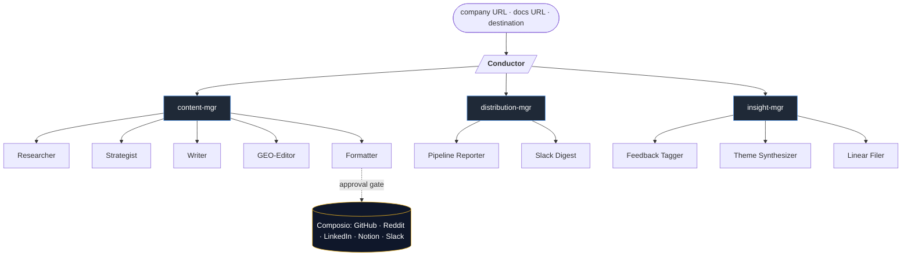

# GMaestro

> People don't understand your product, so they don't care.

GMaestro is the G-stack for technical content. Brief it on your company — a website URL, a file, a folder, anything — and pick where to publish: your website, Reddit, X, LinkedIn, you name it. Ten specialists research your space, draft in your voice, optimize for SEO and GEO, and land an approval card on the dashboard. You approve once; the dispatcher ships it.

---

## Quickstart

Requires **Node 22+** ([`.nvmrc`](./.nvmrc)) and `pnpm`.

```bash
git clone https://github.com/sebtsang/gmaestro
cd gmaestro
pnpm install
pnpm db:migrate              # creates ~/.gmaestro/gmaestro.db
pnpm gmaestro setup          # interactive — keys + Composio
pnpm dev                     # dashboard at http://localhost:3000
```

Fill the 3-input form on the dashboard (company URL + docs URL + destination), hit Run, watch the team work.

---

## Try it without API keys

Skip every cloud setup. The dashboard ships with a mock driver that produces a fake DAG, fake personas, and a fake approval card so you can click through the full flow without burning a token:

```bash
NEXT_PUBLIC_USE_MOCKS=1 pnpm dev
```

---

## Auth setup

Three paths to give GMaestro an LLM. All work; pick one.

| Method | Cost | Setup |
|---|---|---|
| **Claude Pro/Max OAuth** | $0 (uses your subscription) | `claude setup-token` → paste the `sk-ant-oat01-…` token into `.env` as `CLAUDE_CODE_OAUTH_TOKEN=` |
| **Anthropic API key** | ~$1–$2 per run | `ANTHROPIC_API_KEY=sk-ant-api03-…` from [console.anthropic.com](https://console.anthropic.com/settings/keys) |
| **Ollama Cloud (Kimi/Qwen)** | $0 on Ollama Pro | `OLLAMA_API_KEY=…` + `GMAESTRO_LLM_PROVIDER=ollama` |

The OAuth path is the cheapest first run if you already have Claude Pro or Max. The token is long-lived, billed against your subscription, and the SDK picks it up via the bundled `claude-code` binary. Composio integrations (Firecrawl, Reddit, LinkedIn, etc.) need a separate `COMPOSIO_API_KEY` — `pnpm gmaestro setup` walks you through it.

---

## Architecture

One Conductor plans the workflow. Three department heads sub-agent the planning. Ten specialists do the work. Composio executes — but only after the founder approves.



Personas reason in pure LLM over local data — your docs, your blog (for voice), Reddit/X/Perplexity (for signal). External writes only happen post-approval through the deterministic dispatcher. No persona has live tool access; this eliminates tool-selection hallucination on smaller models.

---

## Personas

### Content (5)

| Persona | Model | Role |
|---|---|---|
| **Researcher** | Sonnet | Pre-fetches Firecrawl (docs + company blog), Reddit, X, Perplexity. Computes a 10-rule `VoiceFingerprint`. Recommends the angle. |
| **Strategist** | Sonnet | Picks the angle, locks word count + section count + rhetorical move per destination. |
| **Writer** | Haiku | Drafts the long form in your voice. Translates the doc; refuses to summarize. |
| **GEO-Editor** | Sonnet | Direct-answer lead, fact density, schema markup, citation-friendly structure. |
| **Formatter** | Sonnet | Per-destination formatting. Fans out one variant per channel ticked at the BlogDraft approval. |

### Distribution (2)

| Persona | Model | Role |
|---|---|---|
| **Pipeline Reporter** | Sonnet | End-of-run status digest. |
| **Slack Digest** | Sonnet | Posts the digest to a Slack channel or DMs the founder. |

### Insight (3)

| Persona | Model | Role |
|---|---|---|
| **Feedback Tagger** | Haiku | Themes + sentiment from post-publish reactions. |
| **Theme Synthesizer** | Sonnet | Cross-feedback patterns into a Notion doc. |
| **Linear Filer** | Sonnet | Files reader-flagged bugs and feature requests to Linear/GitHub. |

---

## License

MIT.
